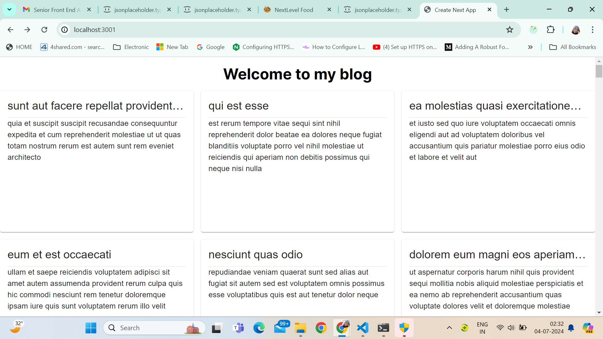
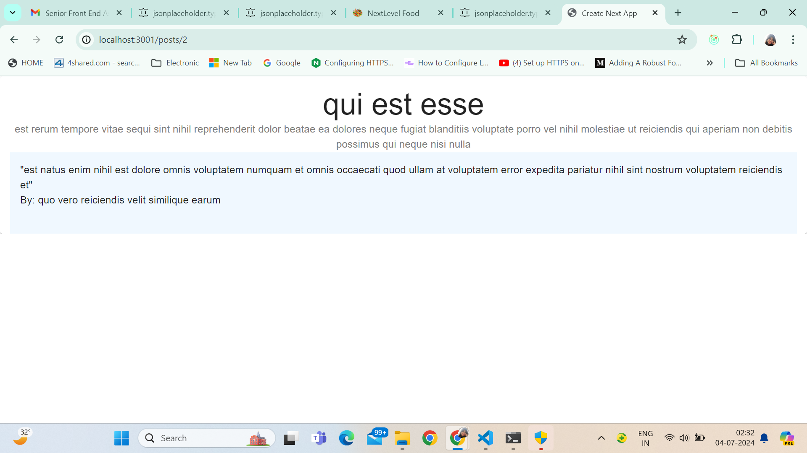

Things to note

Steps to setup:
1. Clone the project - git clone https://github.com/shrutikasinha/blog-nextjs.git
2. Hit npm run dev in terminal at root level
3. And you're all set to check the UI on http://localhost:3000/ (Note make sure there's no other local project running on local server 3000 otherwise check in the terminal and use the port on which it is running)

Quick expaination of what is done:
1. I have tried to use multiple next js features that includes slug, styles imported from page.module.css and routing using app routes. 
2. Basic flow of the app - There is utils folder containing api file which has 2 api calls inside. I import those accordingly inside the components in order to fetch and display the relevant data. 
3. First landing page isa set of cards, click on any card and you shall see the details of the selected card in a new page enabled through slug dynamic routing. 

